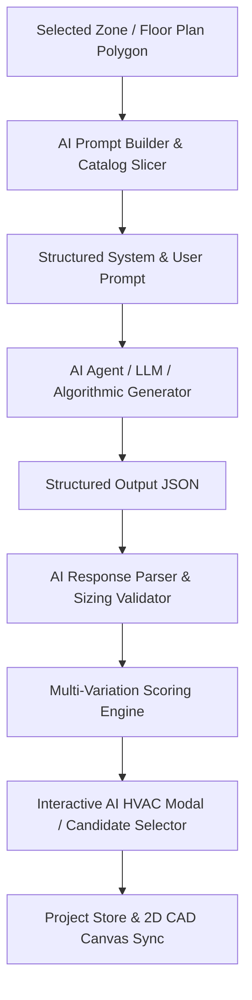

# AI HVAC Design Agent Bridge & Automated Layout Scoring Engine Spec

## 1. Overview & Objectives
This specification defines the architecture and integration of the **AI HVAC Design Agent Bridge** into the MEP desktop application.

The module allows the user to:
1. Automatically generate the exact, highly structured engineering system prompt for any selected zone polygon, including live ASHRAE constraints, load/CFM figures, and sliced manufacturer catalog data.
2. Ingest structured JSON designs from AI models or automated solvers.
3. Automatically generate and score **3 to 5 distinct layout variations** (e.g., Shortest Duct Run, Lowest Noise/Velocity, Minimum Diffuser Count, Balanced Equal ESP).
4. Score candidates via a multi-parameter scoring engine (Cost, Acoustic NC, Pressure Drop ESP, Spatial ADPI coverage, Aspect Ratio penalty).
5. Seamlessly sync the validated AI design into the application store ([`projectStore.ts`](file:///g:/mep%20prog/src/renderer/src/store/projectStore.ts)) and render all diffusers, ducts, and ACU units directly on the 2D CAD canvas ([`FloorPlanCanvas.tsx`](file:///g:/mep%20prog/src/renderer/src/canvas/FloorPlanCanvas.tsx)).

---

## 2. Architecture & Components



### 2.1 File Structure
* [`src/renderer/src/engine/ai/aiHvacPromptBuilder.ts`](file:///g:/mep%20prog/src/renderer/src/engine/ai/aiHvacPromptBuilder.ts)
  * Extracts zone boundary polygon coordinates, area ($\text{sq ft}$ or $\text{sq m}$), ceiling plenum height, total/sensible cooling loads ($\text{BTU/h}$), and total airflow ($\text{CFM}$).
  * Slices matching ACU models from [`STANDARD_EQUIPMENT_CATALOG`](file:///g:/mep%20prog/src/renderer/src/engine/hvacCatalogs.ts) and diffusers from [`STANDARD_DIFFUSER_CATALOG`](file:///g:/mep%20prog/src/renderer/src/engine/hvacCatalogs.ts).
  * Formats the prompt with ASHRAE 62.1, ASHRAE 55, Equal Friction ($0.08\text{ in. w.g.}/100\text{ ft}$), velocity limits ($1000\text{--}1500\text{ fpm}$ mains, $700\text{--}1000\text{ fpm}$ branches, $\le 4:1$ aspect ratio), and required JSON schema.

* [`src/renderer/src/engine/ai/aiHvacResponseParser.ts`](file:///g:/mep%20prog/src/renderer/src/engine/ai/aiHvacResponseParser.ts)
  * Validates JSON syntax and schema conformity.
  * Verifies geometric coordinate bounds (diffusers and duct endpoints fall within or near the zone bounding box).
  * Re-calculates and validates fluid dynamics:
    * Equal Friction method diameter: $D_e = 1.30 \times \frac{(a \cdot b)^{0.625}}{(a + b)^{0.25}}$
    * Duct velocity: $V = \frac{\text{CFM}}{\text{Area}(\text{sq ft})}$
    * Aspect ratio check: $\frac{\max(W, H)}{\min(W, H)} \le 4.0$
    * Total estimated external static pressure vs ACU fan curve.
  * Converts validated layout into application-native `Diffuser` and `DuctSegment` items.

* [`src/renderer/src/engine/ai/aiHvacScoringEngine.ts`](file:///g:/mep%20prog/src/renderer/src/engine/ai/aiHvacScoringEngine.ts)
  * Evaluates and ranks layout options:
    * **Cost / Material Weight**: Total duct length and sheet metal surface area.
    * **Acoustics & NC**: Maximum duct velocity and diffuser discharge NC ratings.
    * **Pressure Drop / Energy Efficiency**: Critical path static pressure drop (in. w.g.).
    * **Spatial Uniformity & ADPI**: Diffuser overlap and distance-to-wall ($70\%$ spacing rule).
  * Calculates a composite Compliance Score ($0\text{--}100$).

* [`src/renderer/src/engine/ai/aiHvacGenerator.ts`](file:///g:/mep%20prog/src/renderer/src/engine/ai/aiHvacGenerator.ts)
  * Core programmatic generator creating 3 distinct layout variations natively:
    1. **Variation 1 (Balanced ASHRAE)**: Standard equal-friction tree routing with optimal diffuser pitch.
    2. **Variation 2 (Acoustic / Low Velocity)**: Oversized branch ducts ($<800\text{ fpm}$), low NC diffuser selections.
    3. **Variation 3 (Compact / Shortest Run)**: Centralized ACU placement with direct trunk-line minimizer.

* [`src/renderer/src/components/AiHvacAssistantModal.tsx`](file:///g:/mep%20prog/src/renderer/src/components/AiHvacAssistantModal.tsx)
  * Interactive modal accessible via Toolbar.
  * Displays the formatted AI System & User Prompt with a "Copy Prompt" button.
  * Allows generating 3 AI variations on-demand or pasting custom AI JSON responses.
  * Displays comparison table with metrics (Total Duct Length, Max Velocity, Total ESP, Compliance Score).
  * "Apply to Canvas" button commits the chosen variation to the project state.

---

## 3. Data Schema & Contracts

### 3.1 AI Output JSON Schema
```typescript
export interface AiHvacDesignOutput {
  systemSummary: {
    selectedAcuModel: string;
    totalCfm: number;
    totalBtuPerHour: number;
    estimatedTotalStaticPressureInWg: number;
    fanSpeedSetting?: 'low' | 'medium' | 'high';
  };
  acuPlacement: {
    x: number;
    y: number;
    rotationDeg?: number;
    serviceClearanceOk: boolean;
  };
  diffuserLayout: Array<{
    id: string;
    x: number;
    y: number;
    modelId: string;
    size: string;
    cfm: number;
    coverageRadiusFt: number;
    throwDistanceFt: number;
    ncLevel: number;
  }>;
  ductNetwork: Array<{
    id: string;
    type: 'trunk' | 'branch' | 'return';
    startX: number;
    startY: number;
    endX: number;
    endY: number;
    shape: 'rectangular' | 'round';
    widthIn: number;
    heightIn: number;
    diameterIn?: number;
    cfm: number;
    velocityFpm: number;
    frictionRateInWgPer100Ft: number;
  }>;
  compliance: {
    score: number; // 0 - 100
    ashrae621VentilationCompliant: boolean;
    ashrae55DraftCompliant: boolean;
    maxVelocityCompliant: boolean;
    aspectRatioCompliant: boolean;
  };
  warnings: string[];
}
```

---

## 4. UI / UX Integration

### 4.1 Toolbar Access
* Add a dedicated **"AI HVAC Agent"** button in [`Toolbar.tsx`](file:///g:/mep%20prog/src/renderer/src/components/Toolbar.tsx) with a spark icon (`Sparkles` or `BrainCircuit`).
* Clicking it opens the [`AiHvacAssistantModal.tsx`](file:///g:/mep%20prog/src/renderer/src/components/AiHvacAssistantModal.tsx).

### 4.2 Modal Capabilities
1. **Zone Selector**: Choose which zone polygon to design.
2. **Prompt Inspector tab**: View/Copy the dynamically generated prompt with exact room coordinates & equipment catalog items.
3. **AI Layout Variations tab**:
   * View generated layout variations side-by-side.
   * View radar / comparative bar charts for Cost vs Noise vs Pressure Drop.
   * Preview layout before applying.
4. **Direct Import tab**: Paste any LLM JSON output to validate, re-size, and apply directly to the active zone.

---

## 5. Verification & Test Plan

### 5.1 Automated Unit & Integration Tests
* `src/renderer/src/engine/__tests__/aiHvacPromptBuilder.test.ts`:
  * Tests prompt generation with various zone geometries, load numbers, and catalog injections.
* `src/renderer/src/engine/__tests__/aiHvacResponseParser.test.ts`:
  * Tests JSON parsing, coordinate range validation, and duct sizing checks.
* `src/renderer/src/engine/__tests__/aiHvacScoringEngine.test.ts`:
  * Tests scoring variations and multi-objective ranking.

### 5.2 End-to-End Verification
* Launch app, select a sample room polygon, trigger AI HVAC modal, generate 3 layout variations, apply the optimal candidate, and verify that diffusers, ducts, and badges appear accurately on the canvas.
