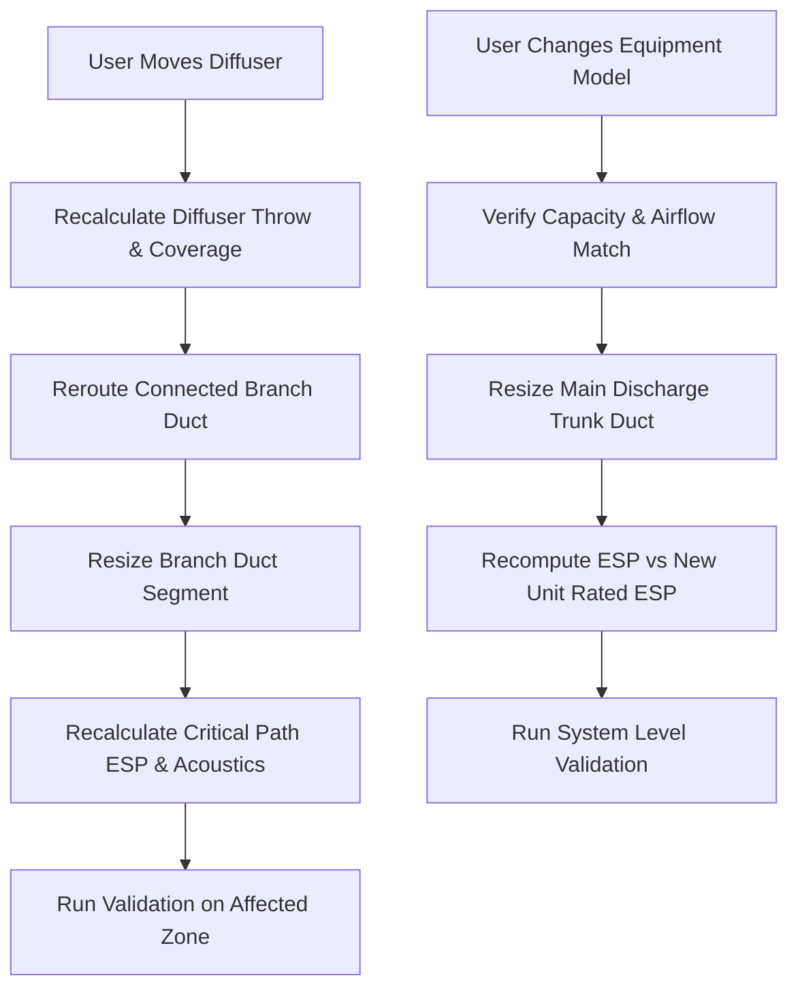

# AI HVAC Design Orchestrator & End-to-End Workflow Specification

## 1. Executive Summary & Objective
This specification formalizes the **AI HVAC System Design Orchestration Engine** for MEP CAD. The orchestrator unifies existing deterministic engineering modules across zoning, equipment selection, diffuser distribution, telescopic stepped duct routing, equal-friction sizing, static pressure calculations, acoustic modeling, and ASHRAE validation into a single, predictable, and traceable workflow.

The architecture enforces a strict **Hybrid AI + Deterministic Engineering Separation**:
- **AI / Decision Layer**: Selects workflow strategies, maps failure diagnostics to optimization actions, chooses valid candidates, and generates engineering explanations.
- **Deterministic Engineering Core**: Computes heat loads, airflows, equipment sizing, diffuser throw/coverage, duct dimensions, velocities, static pressure drops, and acoustics.

---

## 2. System Architecture & Module Organization

```text
src/renderer/src/engine/
├── orchestrator/
│   ├── orchestratorTypes.ts             # Contracts, phase enums, decisions & results
│   ├── designStateMachine.ts            # Live execution state tracker & progress events
│   ├── hvacDesignWorkflow.ts            # Phase execution coordinator with dependency checks
│   ├── optimizationLoop.ts              # Failure-aware iterative feedback solver
│   ├── partialRecalculationEngine.ts   # Dependency-graph selective invalidation engine
│   └── hvacDesignOrchestrator.ts        # Main async entry point: autoDesignHVAC()
│
├── adapters/                            # Adapters wrapping existing engine modules
│   ├── zoningAdapter.ts                 # Wraps zonePartitioner & geometry
│   ├── loadAirflowAdapter.ts            # Wraps loadCalc & solarLoadWeighting
│   ├── equipmentAdapter.ts              # Wraps equipmentSelector & hvacCatalogs
│   ├── terminalAdapter.ts               # Wraps diffuserPlacer, returnPlacer & catalogs
│   ├── ductAdapter.ts                   # Wraps steppedDuctRouter & aerodynamicDuctSizer
│   └── validationAdapter.ts             # Wraps hvacValidator & specialized validators
│
├── zoning/                              # Existing deterministic partitioning
├── systemArchitecture/                  # Existing equipment selection & resolution
├── terminals/                           # Existing diffuser & return placement
├── ducts/                               # Existing stepped routing & aerodynamic sizing
├── validation/                          # Existing 9-point ASHRAE & NFPA validators
├── standards/                           # Existing design profiles (ASHRAE, SMACNA, NFPA)
└── ai/                                  # Existing prompt building & scoring engines
```

---

## 3. Phase Pipeline & Phase Contracts

### 3.1 Phase Enumeration
```typescript
export enum HVACDesignPhase {
  INPUT_ANALYSIS = 'INPUT_ANALYSIS',
  ZONE_VALIDATION = 'ZONE_VALIDATION',
  LOAD_ANALYSIS = 'LOAD_ANALYSIS',
  AIRFLOW_CALCULATION = 'AIRFLOW_CALCULATION',
  SYSTEM_SELECTION = 'SYSTEM_SELECTION',
  EQUIPMENT_SELECTION = 'EQUIPMENT_SELECTION',
  AIR_DISTRIBUTION = 'AIR_DISTRIBUTION',
  TERMINAL_SELECTION = 'TERMINAL_SELECTION',
  TERMINAL_PLACEMENT = 'TERMINAL_PLACEMENT',
  DUCT_TOPOLOGY = 'DUCT_TOPOLOGY',
  DUCT_ROUTING = 'DUCT_ROUTING',
  DUCT_SIZING = 'DUCT_SIZING',
  PRESSURE_ANALYSIS = 'PRESSURE_ANALYSIS',
  ACOUSTIC_VALIDATION = 'ACOUSTIC_VALIDATION',
  COMFORT_VALIDATION = 'COMFORT_VALIDATION',
  FINAL_VALIDATION = 'FINAL_VALIDATION',
  OPTIMIZATION = 'OPTIMIZATION',
  COMPLETE = 'COMPLETE',
  FAILED = 'FAILED'
}
```

### 3.2 Phase Contract Interface
```typescript
export interface PhaseValidationResult {
  valid: boolean;
  warnings: string[];
  errors: string[];
}

export interface HVACDesignPhaseContract<TInput, TOutput> {
  phase: HVACDesignPhase;
  execute(input: TInput, context: HVACDesignContext): Promise<TOutput>;
  validateOutput(output: TOutput): PhaseValidationResult;
}
```

---

## 4. Engineering Traceability & State Management

### 4.1 Transient Execution State vs. Persistent Result Contract

To decouple live workflow progress from immutable engineering deliverables:

```typescript
export interface HVACDesignState {
  currentPhase: HVACDesignPhase;
  progressPercent: number;
  status: 'IDLE' | 'RUNNING' | 'OPTIMIZING' | 'COMPLETE' | 'FAILED';
  currentIteration: number;
  warnings: EngineeringWarning[];
  errors: EngineeringError[];
}

export interface HVACDesignExecution {
  state: HVACDesignState;
  currentArtifacts: Partial<HVACDesignArtifacts>;
  logs: string[];
}

export interface HVACDesignArtifacts {
  zones: EquipmentServiceZone[];
  loads: Record<string, ZoneLoadResult>;
  airflows: Record<string, ZoneAirflowResult>;
  selectedSystems: Record<string, SelectedSystemArchitecture>;
  selectedEquipment: Record<string, SelectedEquipmentResult>;
  terminals: CoordinatedAirTerminal[];
  returnGrilles: CoordinatedAirTerminal[];
  ductNetwork: SteppedDuctSection[];
  returnDuctNetwork?: SteppedDuctSection[];
  pressureResults: Record<string, StaticPressureResult>;
  acousticResults: Record<string, AcousticAnalysisResult>;
  comfortResults: Record<string, ComfortValidationResult>;
}

export interface HVACDesignResult {
  status: 'PASS' | 'WARNING' | 'FAIL';
  artifacts: HVACDesignArtifacts;
  validationReport: MasterValidationReport;
  optimizationHistory: OptimizationAction[];
  decisionLog: DesignDecisionLog[];
  executionSummary: {
    totalDurationMs: number;
    iterationsRun: number;
    phasesExecuted: HVACDesignPhase[];
    initialPassStatus: 'PASS' | 'WARNING' | 'FAIL';
    finalPassStatus: 'PASS' | 'WARNING' | 'FAIL';
  };
}
```

### 4.2 Engineering Decision Log
```typescript
export interface DesignDecisionLog {
  id: string;
  phase: HVACDesignPhase;
  decisionType:
    | 'SYSTEM_SELECTION'
    | 'EQUIPMENT_SELECTION'
    | 'DIFFUSER_SELECTION'
    | 'DIFFUSER_PLACEMENT'
    | 'DUCT_ROUTE'
    | 'DUCT_SIZE'
    | 'OPTIMIZATION';
  inputs: Record<string, unknown>;
  constraintsApplied: string[];
  engineeringRulesApplied: string[];
  candidatesEvaluated?: Array<{ id: string; name: string; score: number; details: Record<string, unknown> }>;
  selectedCandidate: string;
  rejectionReasons?: string[];
  deterministicEngine: string;
  reasonForSelection: string;
  validationResult?: 'PASS' | 'WARNING' | 'FAIL';
  timestamp: number;
}
```

---

## 5. Failure-Aware Optimization Restart & Action Contract

### 5.1 Optimization Action Contract
```typescript
export interface OptimizationAction {
  id: string;
  iteration: number;
  failureCategory:
    | 'CAPACITY'
    | 'AIRFLOW'
    | 'COVERAGE'
    | 'THROW'
    | 'NOISE'
    | 'VELOCITY'
    | 'PRESSURE'
    | 'COMFORT'
    | 'GEOMETRY';
  affectedZones: string[];
  affectedComponents: string[];
  restartPhase: HVACDesignPhase;
  actionType: string;
  beforeValues: Record<string, unknown>;
  afterValues: Record<string, unknown>;
  expectedImprovement: string;
  actualValidationResult?: 'PASS' | 'WARNING' | 'FAIL';
}
```

### 5.2 Failure-to-Restart Mapping
The optimization engine parses the validation failures produced by `hvacValidator.ts` and restarts execution strictly at the **earliest affected dependency**:

| Failure Category | Trigger Condition | Corrective Action | Earliest Restart Phase | Downstream Recalculation |
| :--- | :--- | :--- | :--- | :--- |
| **GEOMETRY** | Self-intersection / invalid boundary | Adjust room polygon inset / report error | `ZONE_VALIDATION` | `LOAD_ANALYSIS` $\to$ All downstream |
| **CAPACITY** | Equipment capacity < design load | Upsize model / split into multi-unit | `EQUIPMENT_SELECTION` | `AIR_DISTRIBUTION` $\to$ All downstream |
| **AIRFLOW** | Supply CFM $\ne$ Diffuser CFM total | Rebalance terminal CFM distribution | `AIR_DISTRIBUTION` | `TERMINAL_SELECTION` $\to$ All downstream |
| **NOISE (NC)** | Diffuser NC > Space NC target | 1. Upsize diffuser neck/face size<br>2. Increase count ($N \to N+1$) | `TERMINAL_SELECTION` | `TERMINAL_PLACEMENT` $\to$ Ducts $\to$ Validation |
| **COVERAGE** | Geometric coverage < 98% | 1. Try larger diffuser throw<br>2. Increase diffuser count ($N \to N+1$) | `TERMINAL_PLACEMENT` | `DUCT_TOPOLOGY` $\to$ Ducts $\to$ Validation |
| **VELOCITY** | Duct velocity > Profile max FPM | Upsize duct cross-section ($W \times H$) | `DUCT_SIZING` | `PRESSURE_ANALYSIS` $\to$ Validation |
| **PRESSURE** | Critical ESP > Available Fan ESP | 1. Upsize duct friction limit ($0.10 \to 0.08$ in.wg)<br>2. Select higher-ESP equipment | `DUCT_SIZING` (Option 1)<br>`EQUIPMENT_SELECTION` (Option 2) | Downstream duct / validation phases |
| **COMFORT** | Excessive draft / throw collision | Adjust terminal positions / deflectors | `TERMINAL_PLACEMENT` | `DUCT_ROUTING` $\to$ Ducts $\to$ Validation |

Maximum optimization iterations: 5. If constraints remain unsatisfied after 5 iterations, the orchestrator produces a `WARNING` or `FAIL` report with explicit engineering diagnostics.

---

## 6. Dependency-Graph Partial Recalculation

When a user modifies an existing design on the canvas or in the inspector, `partialRecalculationEngine.ts` inspects the dirty component and invalidates only affected nodes in the DAG:



---

## 7. Acceptance Scenarios & Verification Matrix

The implementation will be verified against the following comprehensive test suite:

- **SC-01 (Single Rectangular Room)**: Standard office space ($400\text{ ft}^2$, $14,000\text{ Btu/h}$, $500\text{ CFM}$). Runs auto-design $\to$ passes all 9 validation points with 0 errors.
- **SC-02 (Multi-Zone Building)**: 3 adjacent zones sharing ducted equipment. Auto-design computes correct downstream CFM reductions along the main trunk and balances branch airflows.
- **SC-03 (L-Shaped Complex Geometry)**: Non-convex polygon. Diffuser coverage achieves $\ge 98\%$ using centroidal/orthogonal distribution avoiding wall collisions.
- **SC-04 (High Diffuser Noise Correction)**: Initial high-flow terminal exceeds NC 30. Optimization loop increases diffuser count to 2, reducing NC below 28 and passing validation.
- **SC-05 (Excessive Static Pressure Correction)**: High friction path exceeds 0.35 in. wg ESP. Optimization loop reduces friction rate, expands duct sizing, and brings ESP within fan rating.
- **SC-06 (Equipment Capacity Shortfall)**: Design load increased to 6 Tons. Optimizer detects unit undersizing, queries catalog, and upgrades candidate equipment.
- **SC-07 (User Diffuser Override)**: User moves Diffuser D-02 by $5\text{ ft}$. Partial recalculation only updates connected runout branch duct, throw coverage, and zone validation without recalculating unrelated zones.
- **SC-08 (User Zone Boundary Override)**: User modifies room dimensions. Invalidation propagates to load, airflow, equipment, and ducts for that zone only.
- **SC-09 (Invalid Geometry Rejection)**: Self-intersecting polygon supplied. Pipeline safely stops at `ZONE_VALIDATION` with actionable error and zero unhandled exceptions.
- **SC-10 (Full Regression Preservation)**: All 44 existing Vitest test suites in `src/renderer/src/engine/__tests__/` continue to pass without regression.
